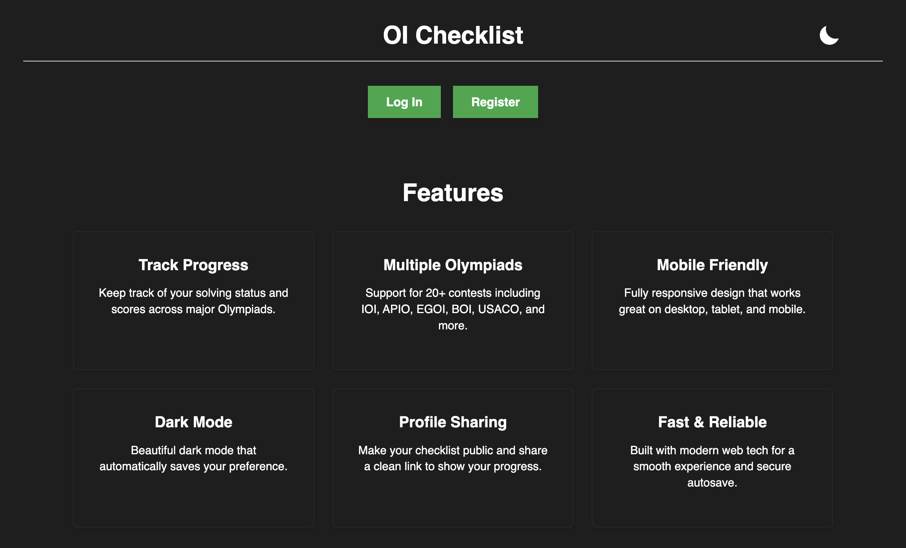
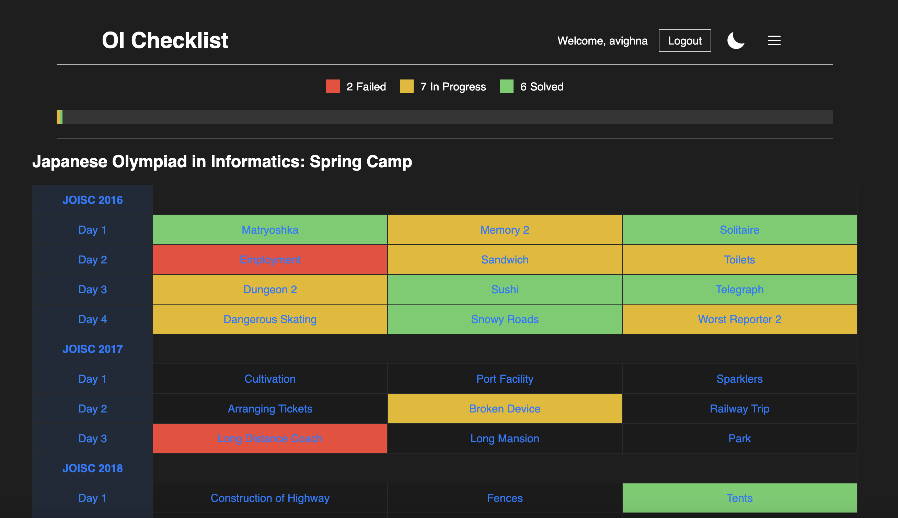
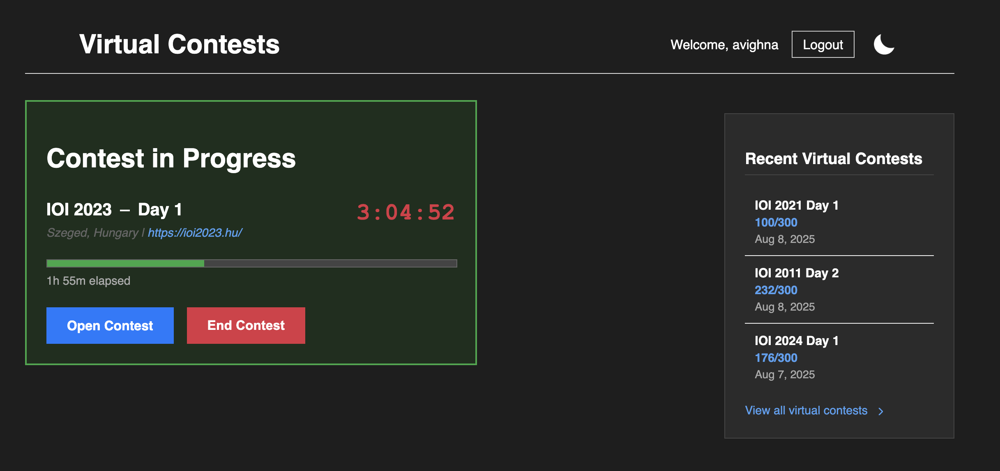
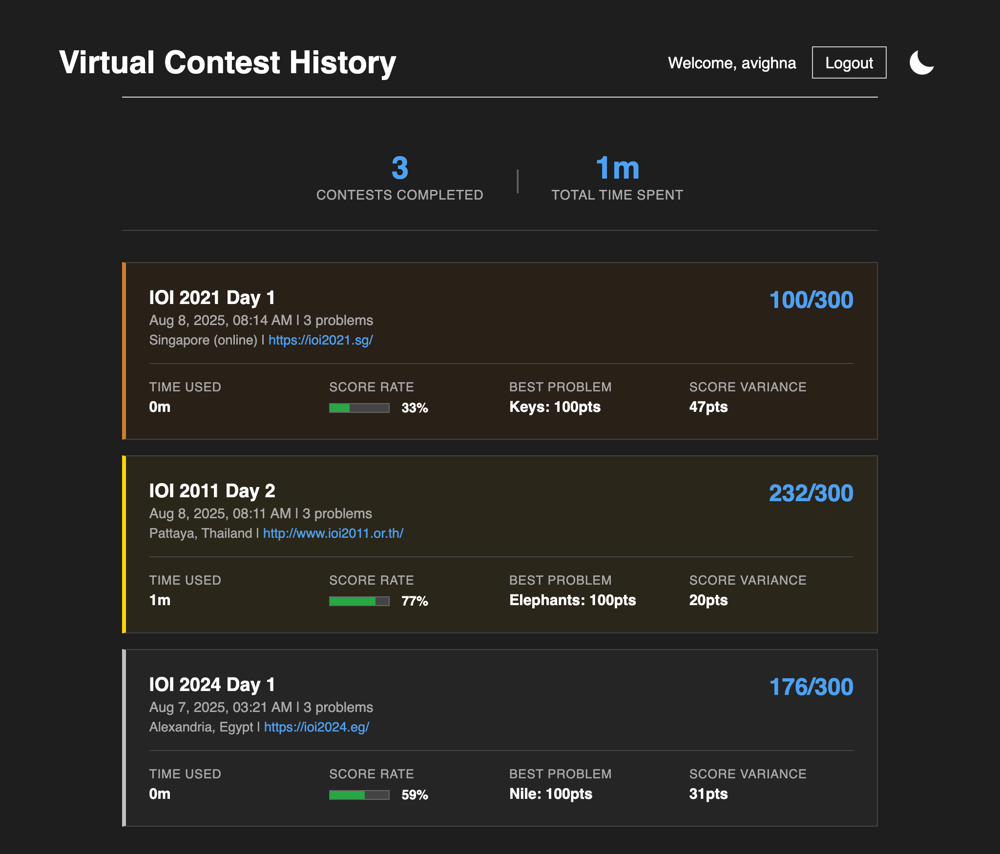
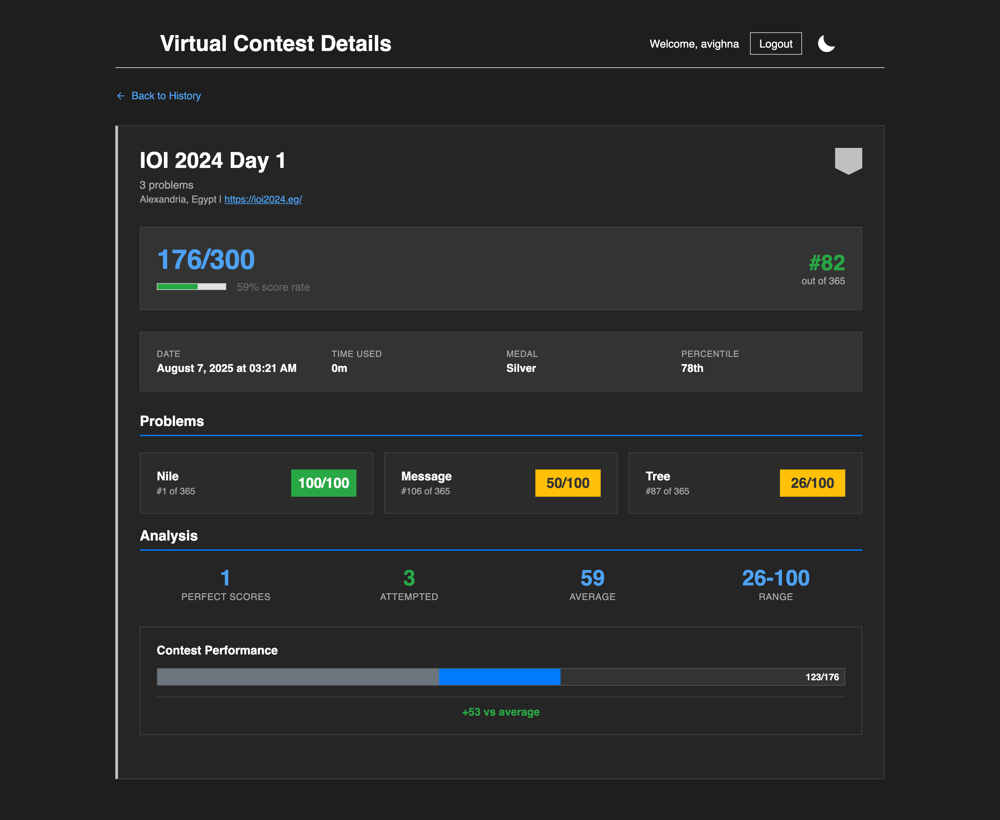

# oi-checklist

A modern, full-featured web app for tracking progress across major Olympiads in Informatics — from IOI and USACO to APIO and EGOI.

Try it live: [https://checklist.spoi.org.in](https://checklist.spoi.org.in) or explore the interface using a demo account: [https://checklist.spoi.org.in/demo](https://checklist.spoi.org.in/demo).

---

## Features

* **Precise tracking:** Mark problems as solved, partially solved, or assign exact scores out of 100.
* **Organized by origin:** Problems are grouped by contest, year, and round.
* **Virtual contests:** Start official past contests with a live timer and full performance tracking.
* **Submission analysis:** For contests on [oj.uz](https://oj.uz), submissions are auto-synced and scored per subtask.
* **Real performance data:** Post-contest screens show rank, percentile, medal, and more — all based on actual historical results.
* **oj.uz sync:** Automatically update your checklist progress using your past submissions.
* **Responsive UI with dark mode:** Built for clarity across devices.
* **Reordering & hiding**: Arrange Olympiads in any order you like, and hide those you don’t want cluttering your view.
* **Custom notes**: Attach personal notes to problems for strategy, hints, or reminders, enhanced with a rudimentary markdown editor.

---

## Screenshots

### Landing Page & Dashboard

<p align="center">
  
</p>
<p align="center"><i>Dark mode landing page – clean, responsive</i></p>

<p align="center">
  
</p>
<p align="center"><i>Dashboard after logging in – track scores, status, and more</i></p>

---

### Virtual Contests

<p align="center">
  
</p>
<p align="center"><i>Ongoing virtual contest – live timer, progress, and end controls</i></p>

<p align="center">
  
</p>
<p align="center"><i>View history of all past virtual contests</i></p>

<p align="center">
  
</p>
<p align="center"><i>Detailed breakdown of performance – rank, medal, percentile, and more</i></p>

<p align="center"><i><small>Note: The scores shown in these screenshots have been arbitrarily chosen and may not reflect a score that's actually achievable under real contest scoring rules.</small></i></p>

---

## Supported Olympiads

The checklist supports a wide range of Olympiads in Informatics:

### Core Olympiads

* Singapore National Olympiad in Informatics (NOI)
* Asia-Pacific Informatics Olympiad (APIO)
* Central European Olympiad in Informatics (CEOI)
* International Olympiad in Informatics (IOI)
* Indian National Olympiad in Informatics (INOI)
* Indian Zonal Computing Olympiad (ZCO)
* USA Computing Olympiad (USACO):

  * Bronze
  * Silver
  * Gold
  * Platinum
* Croatian Olympiad in Informatics (COI)
* Indian IOI Training Camp (IOITC) _(problems are private and accessible only to IOITC participants)_
* Japanese Olympiad in Informatics:

  * Spring Camp
  * Final Round
  * Open Contest
* European Girls' Olympiad in Informatics (EGOI)
* European Junior Olympiad in Informatics (EJOI)
* International Zhautykov Olympiad (IZHO)
* Polish Olympiad in Informatics (POI)
* Baltic Olympiad in Informatics (BOI)

### Miscellaneous

* Google Kick Start

---

## Local Development Instructions

> Requires Python 3 installed locally.

### 0. Create a `.env` file

In the `backend/` directory, create a `.env` file with the following values:

| Variable                | Description                                                      |
| ----------------------  | ---------------------------------------------------------------- |
| `PORT`                  | The port your backend will run on.                               |
| `FLASK_ENV`             | Set to `local` for local development                             |
| `DATABASE_PATH`         | Path to your SQLite database (e.g., `database.db`)               |
| `BACKEND_DIR`           | Absolute path to the `backend/` folder                           |
| `FRONTEND_URL`          | URL where the frontend runs (e.g., `http://localhost:5501`)      |
| `BACKEND_URL`           | URL where the Flask backend runs (e.g., `http://localhost:5001`) |
| `GITHUB_CLIENT_ID`      | GitHub OAuth client ID                                           |
| `GITHUB_CLIENT_SECRET`  | GitHub OAuth client secret                                       |
| `DISCORD_CLIENT_ID`     | Discord OAuth client ID                                          |
| `DISCORD_CLIENT_SECRET` | Discord OAuth client secret                                      |
| `GOOGLE_CLIENT_ID`      | Google OAuth client ID                                           |
| `GOOGLE_CLIENT_SECRET`  | Google OAuth client secret                                       |
| `QOJ_USER`              | Username for an account that will be used to scrape qoj.ac (VCs) |
| `QOJ_PASS`              | Corresponding password for that account (to refresh sessions)    |

---

### 1. Install Python dependencies

```bash
pip install -r backend/requirements.txt
```

### 2. Initialize the database

```bash
python3 backend/init_db.py
```

### 3. Populate Olympiad problems and contests

```bash
python3 backend/populate_problems.py
python3 backend/populate_contests.py
```

### 4. Start the Flask backend

```bash
python3 backend/app.py
```

### 5. Launch the frontend

Use Live Server (or a simple HTTP server) from the root directory (where `index.html` is located).

> Make sure to update the `apiUrl` in `js/config.js` to match your Flask server’s URL if it differs.

---

## Public Deployment

You can try the live version [here](https://checklist.spoi.org.in/).
To explore without signing up, use the demo account at [https://checklist.spoi.org.in/demo](https://checklist.spoi.org.in/demo).

---

## Contributing

Bug reports, feature requests, and PRs are welcome. Feel free to file an issue or submit a fix.

---

## License

This project is released under the MIT License.
